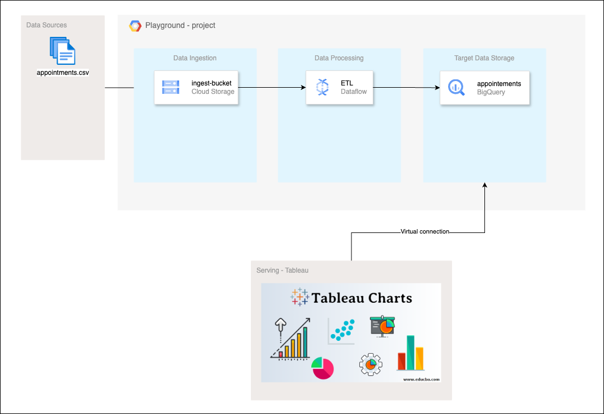

# Doctolib System Design - Terraform Infrastructure

This repository contains the **Terraform** configuration files to provision and manage the infrastructure for the system design assesment, an online healthcare appointment platform.

## Table of Contents
- [Doctolib System Design - Terraform Infrastructure](#doctolib-system-design---terraform-infrastructure)
  - [Table of Contents](#table-of-contents)
  - [Overview](#overview)
  - [Architecture](#architecture)
  - [Prerequisites](#prerequisites)

## Overview
This project uses Terraform to provision cloud infrastructure for the Doctolib system design. The setup includes services such as:
- Google cloud storage
- Google Dataflow
- Google Bigquery
  
## Architecture
The infrastructure is designed to handle both frontend (patient and doctor dashboards) and backend services (appointment management, notifications, etc.).

## Prerequisites
- **Terraform**: Install Terraform by following the [official guide](https://learn.hashicorp.com/tutorials/terraform/install-cli).
- **Cloud Provider Account**: You will need a cloud account (e.g., AWS, GCP, or Azure).
- **Service Account**: Ensure you have access to a service account or credentials for provisioning resources.
- **SSH Key**: For accessing provisioned virtual machines.
